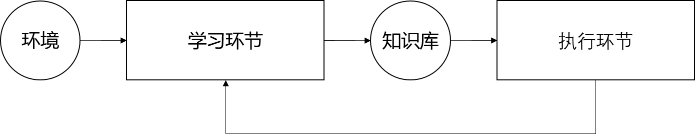

#机器学习调研笔记

## 1. 绪论
机器学习是利用一些方法来使机器（计算机）实现人的学习行为，以便获取新的知识或技能，重新组织已有的知识结构使之不断改善自身的性能。

如果一个计算机程序针对某类任务 T，可以用 P 衡量的性能，根据某种学习策略L来不断完善，则称这个计算机程序从策略 L 中学习，这个学习是专门对任务 T 以目标 P 作为评价指标的。

学习策略：
1. 搜索型策略 
> 为求解目标，以某种搜索策略进行搜索，如状态空间法、A* 算法、BP 算法等

2. 构造型策略 
> 可以分层逐步地构造，并将学习系统地基本功能模块划分成若干独立地功能子模块

3. 规划型策略 
> 为解决搜索型策略所存在地部分不足，可将网络地某个性能看成优化目标，在分类网络学习学习问题中，将网络必须满足的条件作为约束条件，而将网络的某一性能作为目标函数，把网络学习和综合问题转换成一个数学规划问题进行求解。 

三大学习策略可细分为几种基本学习：
1. 机械学习
> 又称记忆学习, 是最简单的学习策略，不需要任何推理过程

2. 传授学习
> 又称指导式学习或指点学习。需要一点推理、翻译合转化

3. 演绎学习
> 学习系统由给定的知识进行演绎的保真推理，并存储有用的结论

4. 归纳学习
> 应用推理进行学习

- 实例学习
> 又称概念获取，通过向学习者提供某一概念的正例和反例，使学习者归纳推理出概念的一般描述

- 观察与发现学习
> 又称描述的一般化学习，没有监督者，包括概念聚类、构造分类、曲线拟合、发现并解释观察到的定律并形成理论

5. 类比学习
> 遇到新问题时，可以学习以前解决锅的类似问题的解决办法来解决当前问题

